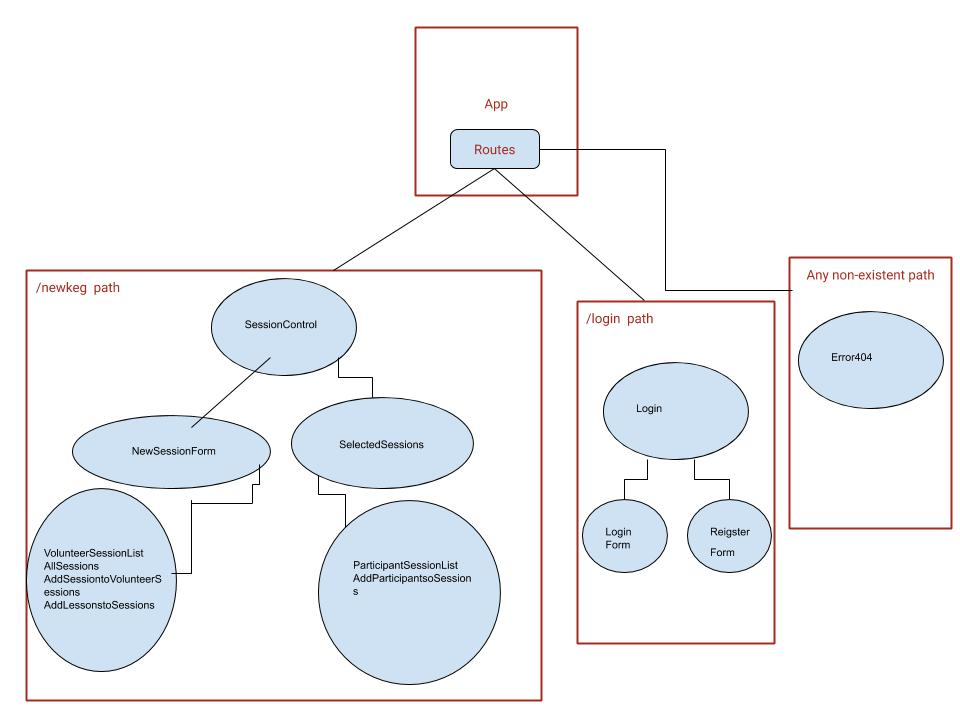

# _Scheduler_

#### _._

#### By _**Carrie Schmid**_

## Description
_Add a list of state slices your application requires: 
masterSessionList: will live in App.jsx and VolunteerDashboard.jsx 
selectedSessionList: will live in VolunteerDashboard.jsx

_Environment including Babel transpiling, Webpack module bundling, a development server with hot module replacement, and linting._
_Uses client-side routing via the React-Router library to create appearance of multiple pages_
_Styles added using CSS objects_

## Specs(Component Tree)

## Setup/Installation Requirements

_download and open browser_

## Known Bugs

_none_

## Support and contact details

_Carrie Schmid: carriepederson7@gmail.com_

## Technologies Used

_C#, React_

### License

*MIT Liscence*

Copyright (c) 2019 **_Carrie Schmid_**
